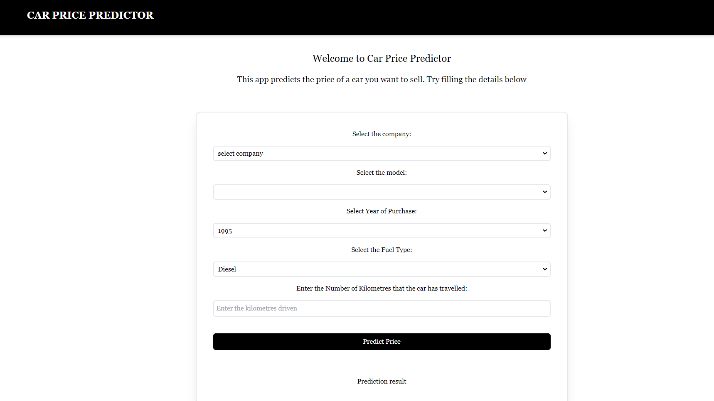
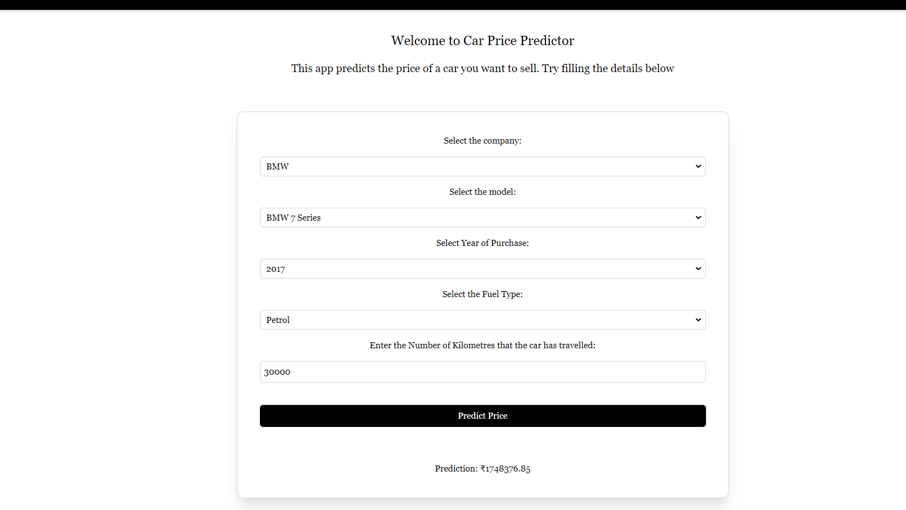

# Car Price Predictor 

This project aims to predict the price of car, by taking some parameters
like company name, model etc.

Project link :- https://pricepredictor-ai.herokuapp.com/

## Overview

# Project Flow
## 1. Data Gathering
Data for the project is gathered from kaggle
[https://www.kaggle.com/balaka18/quikr-cars-scraped/version/1].

## 2. Data Preprocessing
After getting the data we need to clean the data. you can 
Data_cleanning.ipynb in model building directory.
After cleanning the data, we will save the clean data in another file.

## 3. Model Building
After cleanning data, we will create the Simple Linear Regression
Model.The model has R2_score 0.88, for more detail can refer model_building.ipynb
in Model building directory

## 4. Deploying the model
Deply the model on web using Flask framework. 

## 5. Server deployment
after testing the model on localhost, deploy the project on Heroku.
